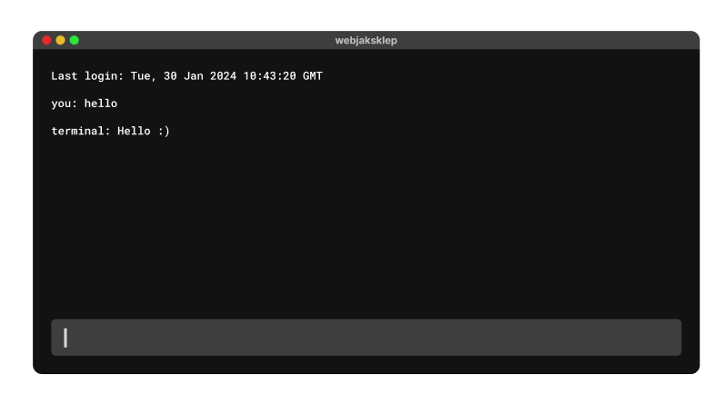

# Project Title

A brief description of what this project does and who it's for

# Console Application

## Screenshots



## Description

This project is a console-based application that provides a terminal-like interface for executing various commands and performing tasks. It is built using HTML, CSS (with SCSS), and JavaScript, offering a dynamic and interactive experience similar to a real terminal.

## Requirements

To run this project, you'll need a web browser that supports JavaScript.

## Installation and Usage

1. Clone the repository:

   ```bash
     git clone https://github.com/YourUsername/recruitment-task3.git
   ```

2. Navigate to the project directory:

   ```bash
   cd recruitment-task3
   ```

3. Open the `index.html` file in your web browser.
4. SCSS is compiled to CSS using Live Sass Compiler v6.1.2. Ensure you have this extension installed in your Visual Studio Code editor, or any other compatible editor, and that it is configured to compile SCSS files to CSS.

## Directory Structure

      ├── index.html
      ├── src
      ├── index.js
      └── modules
         ├── utils.js
         ├── commands.js
         ├── customCommandsDescriptions.js
         ├── terminal.js
         └── styles
      └── styles
         ├── styles.css
         ├── styles.scss
         ├── _layout.scss
         └── _terminal.scss

- `index.html`: Main HTML file containing the terminal interface.
- `src/modules/utils.js`: JavaScript module providing utility functions such as doubling numbers and generating help messages.
- `src/modules/commands.js`: JavaScript module defining the available commands for the terminal.
- `src/modules/customCommandsDescriptions.js`: JavaScript module containing descriptions for custom commands.
- `src/modules/terminal.js`: JavaScript module handling the terminal logic and interactions.
- `src/index.js`: Entry point of the application, initializing the terminal instance.
- `styles/styles.css`: CSS file generated from SCSS, containing styles for the terminal and its components.
- `styles/styles.scss`: SCSS file containing styles for the terminal and its components.
- `styles/_layout.scss`: SCSS file containing layout styles for the terminal interface.
- `styles/_terminal.scss`: SCSS file containing specific styles for the terminal component.

## Technologies Used

- HTML
- CSS (SCSS)
- JavaScript (Vanilla)

## Author

This project was created by Damian Pasterz. Contact: damian.pasterz@gmail.com.

## License

This project is licensed under the MIT License. For more information, see the LICENSE.md file.
